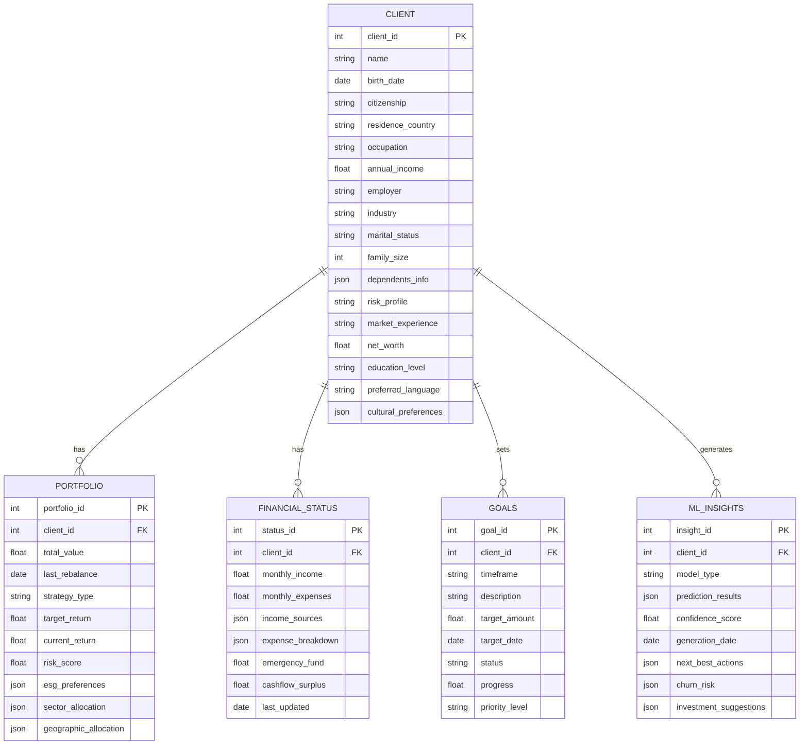

# Wealth Management Data System

This repository contains scripts and schemas for generating and managing mock data for a wealth management system. The system includes comprehensive client information, financial data, portfolio management, and ML insights.

## Table of Contents
- [System Overview](#system-overview)
- [Database Schema](#database-schema)
- [Setup Instructions](#setup-instructions)
- [Data Generation](#data-generation)
- [Sample Data](#sample-data)
- [Loading Data to Database](#loading-data-to-database)

## System Overview

The system manages the following key areas:
- Client personal and financial information
- Investment portfolios and goals
- Risk profiles and market views
- Estate planning and tax information
- Insurance and liabilities
- Machine learning insights
- Lifestyle preferences and financial planning

## Database Schema



## Setup Instructions

1. Install required Python packages:
```bash
pip install faker numpy pyodbc
```

2. Set up SQL Server connection:
   - Create a new database
   - Update connection string in data_loader.py
   - Execute schema creation script

## Data Generation

Run the mock data generation script:
```bash
python generate_mock_data.py
```

This will create a JSON file containing mock data for:
- Client profiles
- Financial information
- Investment portfolios
- Goals and planning
- Market views
- ML insights

## Sample Data

Example of generated mock data:

```json
{
  "clients": [
    {
      "client_id": 1,
      "name": "John Smith",
      "birth_date": "1975-06-15",
      "citizenship": "USA",
      "occupation": "Software Engineer",
      "annual_income": 150000.00,
      "risk_profile": "Moderate",
      "net_worth": 2500000.00
    }
  ],
  "portfolios": [
    {
      "portfolio_id": 1,
      "client_id": 1,
      "total_value": 1500000.00,
      "strategy_type": "Growth",
      "target_return": 0.08,
      "risk_score": 7.5,
      "sector_allocation": {
        "Technology": 0.25,
        "Healthcare": 0.20,
        "Finance": 0.15,
        "Consumer": 0.20,
        "Industrial": 0.20
      }
    }
  ]
}
```

## Loading Data to Database

1. Create database schema:
```sql
-- Execute the SQL script
sqlcmd -S your_server -d your_database -i create_schema.sql
```

2. Load data:
```bash
python data_loader.py
```

The loader will:
- Insert all records
- Maintain referential integrity
- Verify data load
- Check for orphaned records

## File Structure

```
wealth-management-data/
├── README.md
├── scripts/
│   ├── generate_mock_data.py
│   ├── data_loader.py
│   └── create_schema.sql
├── sample_data/
│   └── mock_wealth_management_data.json
└── requirements.txt
```

## Requirements

- Python 3.8+
- SQL Server 2019+
- Required Python packages:
  - faker
  - numpy
  - pyodbc

## Contributing

1. Fork the repository
2. Create your feature branch
3. Commit your changes
4. Push to the branch
5. Create a new Pull Request

## License

This project is licensed under the MIT License - see the LICENSE file for details.
